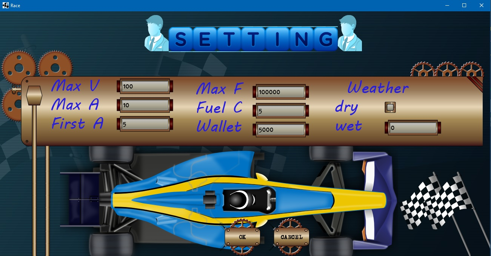
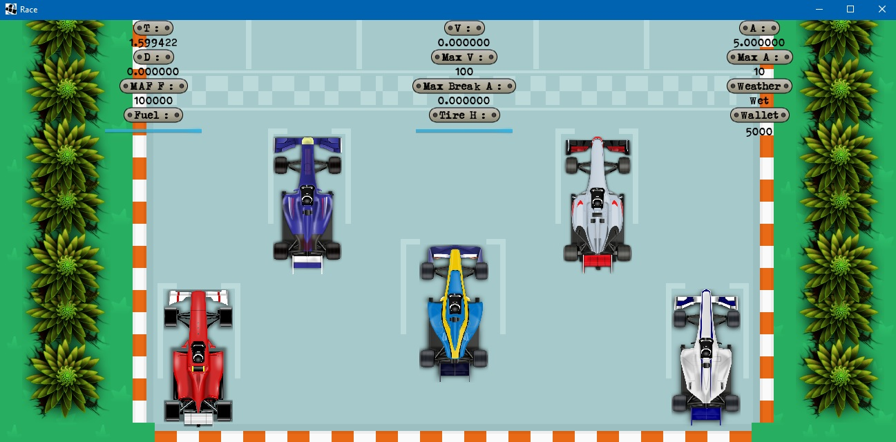
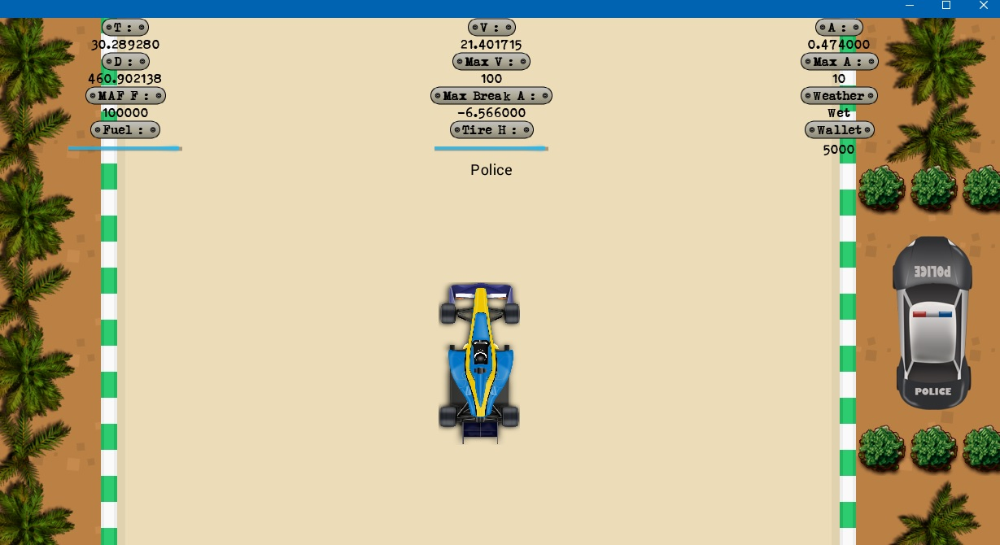
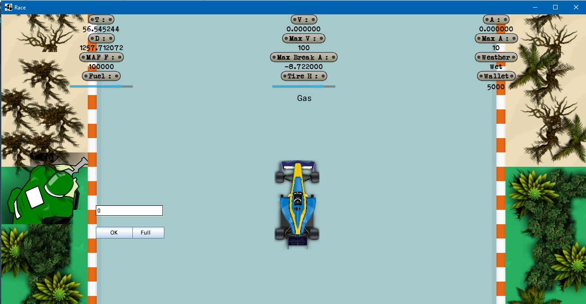
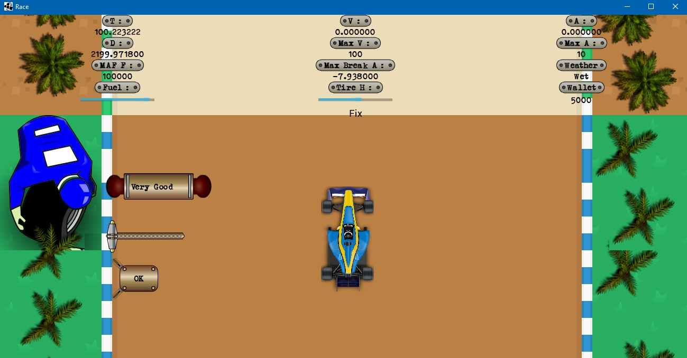

# Need For Speed Hot Java (Racing Simulation)
#### NFS with _LibGDX_ And _BOX2D_ And _Tiled Map_

## Features 
*
*
*
*
*
*
*
*

## Previews

### Setting Screen
* Here you can set some variables like ` Max Velocity, Acceleration and Fuel `, ` First Acceleration `, ` Wallet ` and ` Fuel consumption `
* Select **dry** weather or enter a number from 0 to 10 for **wet** weather ` (0:snow - 10:rain) `
* Click **OK** to go 

##

### Main Screen
* In this Screen you see some details like ` time `, ` distance `, ` max and current velocity `, ` max and current acceleration `, ` max and current fuel `, ` tire health `, ` wallet `, ` weather ` and ` max break acceleration ` 
* Use _Arrow-Up_ key to **accelerate** and _Arrow-Down_ to **break**
* Use _Arrow-Right_ key to go **right** and _Arrow-Left_ to go **left**
* Press _space_ button to **pause**

##

### Police
* If your Speed is upper than **(`MaxV / 2`)** you get a **warning** to **stop** the car, if you did not the police starts to **...** yoy, if he can **catch** you, you have to **pay** but you can **run away** any ways.

##

### Gas Station
* In the text field **enter** any number or click on **full** button

##

### Change Tire
* Select tire state from **combo box**
* Change the **scroll** to set tire health from 0 to 100

##

### Speed Controller Camera
* If your **Speed** is upper than **(`MaxV / 2`)** you have to Pay

